# PulsePoll — Real-Time Live Polling System

[](https://pulsepoll-frontend-xd12.onrender.com)
[](https://pulsepoll-backend-i4aq.onrender.com/api/health)
[](https://github.com/gowthamgopalakrishnan/pulsepoll)

> **Live Deployed Links**:
> - 🌐 **Live Web Application (Frontend)**: **[https://pulsepoll-frontend-xd12.onrender.com](https://pulsepoll-frontend-xd12.onrender.com)**
> - ⚡ **Live API Service (Backend)**: **[https://pulsepoll-backend-i4aq.onrender.com](https://pulsepoll-backend-i4aq.onrender.com)**
> - 📦 **Public GitHub Repository**: **[https://github.com/gowthamgopalakrishnan/pulsepoll](https://github.com/gowthamgopalakrishnan/pulsepoll)**

A production-grade, high-concurrency **Live Polling System** built for the **GUVI / HCL Developer Internship Task**. An authenticated creator creates a poll and shares the link or QR code with an audience. Votes cast by the audience are validated server-side, counted atomically with sub-millisecond latency via Redis, and broadcast live to all active viewers with **zero page refreshes**.

---

## 🏗️ System Architecture & Data Flow

```mermaid
sequenceDiagram
    autonumber
    actor Creator as Poll Creator
    actor Voter as Audience Member
    participant React as React Frontend
    participant Gin as Go Backend (Gin)
    participant Redis as Redis (Counters + Pub/Sub)
    participant Mongo as MongoDB (Storage)

    Creator->>React: Log in & create poll (Title, Options, Expiry)
    React->>Gin: POST /api/polls (JWT authenticated)
    Gin->>Mongo: Persist Poll document
    Gin->>Redis: Initialize option counters (HSetNX)
    Gin-->>React: 201 Created (Poll ID)

    Note over Voter,React: Voter opens /poll/:id or scans QR Code
    React->>Gin: Establish WebSocket /ws/polls/:id
    Gin->>Redis: Subscribe to poll_updates:{id}
    Gin-->>React: Send initial live state snapshot

    Voter->>React: Selects option & clicks "Submit Vote"
    React->>Gin: POST /api/polls/:id/vote (OptionIDs + Fingerprint)
    
    rect rgb(20, 30, 45)
    Note over Gin,Redis: Atomic Redis Operations
    Gin->>Redis: SADD poll:{id}:voters {fingerprint} (Deduplication)
    alt Already voted
        Redis-->>Gin: Return 0 (Duplicate detected)
        Gin-->>React: 409 Conflict ("Already voted")
    else New voter
        Redis-->>Gin: Return 1 (Accepted)
        Gin->>Redis: HINCRBY poll:{id}:votes {option_id} 1 (Atomic counter)
        Gin->>Redis: INCRBY poll:{id}:total 1
        Gin->>Redis: PUBLISH poll_updates:{id} (New payload)
    end
    end

    Redis-->>Gin: Pub/Sub broadcast event received by all server workers
    Gin-->>React: WebSocket message streamed to all connected viewers
    React-->>Voter: UI animates bar percentages dynamically!
    
    par Async DB Persistence
        Gin->>Mongo: Insert Vote audit record & update counts
    end
```



---

## ⚡ Real Use of Each Layer

Each technology in the stack serves a distinct, mission-critical architectural purpose:

### 1. Redis (The Realtime Engine)
- **Sub-millisecond Atomic Counting (`HINCRBY`)**: Under high concurrency (e.g. thousands of live audience members voting simultaneously), standard relational or document database increments create lock contention and write bottlenecks. Redis `HINCRBY` executes in memory in under a millisecond with zero race conditions.
- **Atomic Voter Deduplication (`SADD` / `SISMEMBER`)**: Prevents duplicate voting in $O(1)$ time complexity before touching disk storage.
- **Horizontal Realtime Pub/Sub (`PUBLISH` / `SUBSCRIBE`)**: When an audience member votes, the server publishes to channel `poll_updates:{pollId}`. All running server nodes receive the event and push it down their connected WebSockets, enabling effortless horizontal scaling.
- **Active Poll Caching**: Live vote totals and options are fetched directly from Redis RAM for lightning-fast reads.

### 2. Go with Gin (The High-Concurrency Backend)
- Compiled, lightweight Go binary with minimal memory footprint and high throughput.
- Gorilla WebSockets with a non-blocking goroutine hub (`readPump` / `writePump`), connection heartbeats (ping/pong), and graceful disconnect cleanup.
- Strict server-side validation: verifies string lengths, duplicate option labels, maximum options, poll expiration deadlines, and single vs. multi-choice rules.
- JWT authentication with secure `bcrypt` password hashing protecting poll creation and administration.

### 3. MongoDB (The Persistent Source of Truth)
- Stores persistent user accounts, poll configurations, options, metadata, and timestamps.
- Stores historical vote records with client IP and timestamps for post-poll audit trails.
- Automatic indexing on `users.email` (unique), `polls.creator_id`, and compound index on `votes.poll_id` + `votes.voter_fingerprint`.

### 4. React (The Dynamic Frontend)
- Pure modern CSS system with vibrant dark-mode aesthetics, glowing accents, and glassmorphism.
- WebSocket client with automatic exponential backoff reconnection.
- Interactive components:
  - **Audience Voting Screen**: Instant selection, celebratory confetti micro-interaction (`canvas-confetti`), and responsive layout.
  - **Projector / Presentation View**: Fullscreen projector mode designed for classroom screens and conference halls with high-contrast fonts and embedded QR code.
  - **Dynamic QR Code Modal**: Audience can point their phone camera to vote without typing URLs.

---

## 📁 Project Structure

```
/
├── backend/
│   ├── cmd/server/main.go            # Application entrypoint & Gin route definitions
│   ├── internal/
│   │   ├── config/config.go          # Centralized configuration with env defaults
│   │   ├── database/
│   │   │   ├── mongo.go              # MongoDB connection, models & resilient fallback
│   │   │   └── redis.go              # Redis client: HINCRBY, SADD, Pub/Sub channels
│   │   ├── handlers/
│   │   │   ├── auth_handler.go       # Registration, Login, Profile
│   │   │   ├── poll_handler.go       # Create, List, Status Toggle, Delete
│   │   │   ├── vote_handler.go       # Atomic voting, deduplication & broadcast
│   │   │   └── ws_handler.go         # Gorilla WebSocket connection upgrader
│   │   ├── middleware/
│   │   │   ├── auth.go               # JWT Bearer token authentication
│   │   │   └── cors.go               # CORS configuration
│   │   ├── models/                   # User, Poll, Vote structs & validation tags
│   │   ├── services/                 # WebSocket Hub & Redis channel multiplexer
│   │   └── utils/                    # Password hashing, JWT claims, validations
│   ├── Dockerfile                    # Production multi-stage Go build
│   └── .env.example
│
├── frontend/
│   ├── src/
│   │   ├── api/
│   │   │   ├── client.js             # REST API client & auth tokens
│   │   │   └── websocket.js          # Reconnecting WebSocket manager
│   │   ├── components/
│   │   │   ├── Navbar.jsx            # Header & account controls
│   │   │   ├── Footer.jsx            # Stack badges & credits
│   │   │   ├── LiveResultsChart.jsx  # Animated bar charts & winner highlight
│   │   │   ├── QRCodeModal.jsx       # QR Code scanner generator
│   │   │   └── Toast.jsx             # Toast notification alerts
│   │   ├── pages/
│   │   │   ├── Home.jsx              # Landing page with interactive live demo
│   │   │   ├── Login.jsx             # Sign In
│   │   │   ├── Register.jsx          # Sign Up
│   │   │   ├── Dashboard.jsx         # Creator poll dashboard & metrics
│   │   │   ├── CreatePoll.jsx        # Dynamic poll creation form
│   │   │   ├── VotePoll.jsx          # Audience live voting view
│   │   │   └── ProjectorView.jsx     # Fullscreen presentation projector
│   │   ├── styles/index.css          # Design system & dark theme
│   │   ├── App.jsx                   # Main application router
│   │   └── main.jsx
│   ├── Dockerfile                    # Multi-stage Nginx production build
│   └── nginx.conf                    # Nginx reverse proxy & SPA router
│
├── docker-compose.yml                # One-command orchestration for entire stack
├── DEPLOYMENT_GUIDE.md               # Step-by-step live deployment instructions
└── README.md
```

---

## 🚀 Quick Start & Running Locally

### Option 1: Using Docker Compose (Recommended)

To run the complete stack (MongoDB, Redis, Go Backend, and React Frontend) with a single command:

```bash
# Clone repository
git clone <your-github-repo-url>
cd <repo-folder>

# Start all 4 services
docker compose up --build
```

- **Frontend Application**: `http://localhost:3000`
- **Backend API**: `http://localhost:8080`
- **MongoDB**: `localhost:27017`
- **Redis**: `localhost:6379`

---

### Option 2: Running Directly on Host

#### 1. Backend (Go)
```bash
cd backend

# (Optional) Copy example env
copy .env.example .env

# Run the server (has built-in resilient fallbacks if local mongo/redis aren't started yet)
go run ./cmd/server
```
The Go server will start on `http://localhost:8080`.

#### 2. Frontend (React + Vite)
```bash
cd frontend

# Install dependencies
npm install

# Start Vite development server
npm run dev
```
The React frontend will be accessible at `http://localhost:5173`.

---

## 🛡️ Security & Validation Measures

1. **Server-Side Input Sanitization**:
   - Poll titles are restricted to 3–300 characters.
   - Poll options require at least 2 distinct, non-empty items (case-insensitive deduplication).
   - Poll option IDs are generated with cryptographically secure UUIDs.
2. **Duplicate Vote Prevention**:
   - Every voter browser instance maintains a unique client fingerprint.
   - Redis checks `SADD` atomically; duplicate submissions are rejected immediately with HTTP 409 Conflict.
   - MongoDB enforces a compound unique index on `(poll_id, voter_fingerprint)`.
3. **Poll Expiration & State Guards**:
   - Closed or expired polls cannot accept new votes.
   - Only the poll creator can toggle status, edit settings, or delete the poll.
4. **Credential Security**:
   - Passwords are encrypted with standard `bcrypt` cost factor 10.
   - JWT tokens use HS256 with 7-day expiration.

---

## 🔌 API Reference

### Authentication
- `POST /api/auth/register` — Create a new creator account
- `POST /api/auth/login` — Sign in and receive JWT token
- `GET /api/auth/me` — Retrieve current user profile (Bearer token required)

### Poll Management (Protected)
- `POST /api/polls` — Create a new poll with options and settings
- `GET /api/polls` — List all polls created by the authenticated user
- `PATCH /api/polls/:id/status` — Toggle poll active state (close/re-open)
- `DELETE /api/polls/:id` — Delete poll and associated records

### Public Voting & Audience
- `GET /api/polls/:id` — Retrieve poll details and live counts
- `POST /api/polls/:id/vote` — Cast vote (OptionIDs + VoterFingerprint)
- `GET /api/polls/:id/has-voted?fingerprint=...` — Check if device has voted

### Realtime WebSocket
- `GET /ws/polls/:id` — Upgrades to WebSocket connection, streams live vote distribution and state changes

---

## 🎥 Submission Video & Interview Preparation Guide

The GUVI / HCL submission requires a **3–5 minute video** walking through the project. Here is an outline to follow:

### 1. Demonstration (1.5 – 2 mins)
- Open the application. Log in as a creator.
- Create a new poll with 3 options and show how options can be dynamically added/removed.
- Open the poll in two side-by-side browser windows:
  - Window A: Audience voting screen (`/poll/:id`)
  - Window B: Projector view (`/poll/:id/results`)
- Cast a vote in Window A. Show that Window B updates **instantly with zero refresh** and an animated progress bar.
- Attempt to vote again in Window A to demonstrate **duplicate vote prevention**.

### 2. The Technical Challenge You Faced & Solved (1 min)
> **Recommended talking point**:
> *"The biggest architectural challenge was handling high-concurrency real-time updates without overloading the database or creating race conditions. If 500 audience members vote in the exact same second, updating MongoDB directly causes lock contention, slow response times, and potential vote loss.*
> 
> *To solve this, I designed a Redis-first ingestion pipeline. When a vote arrives, Go executes an atomic Redis `SADD` to verify voter uniqueness and `HINCRBY` to increment option counts in RAM in less than 1 millisecond. Redis Pub/Sub then broadcasts the new state to all connected WebSockets, while a background worker asynchronously writes the vote audit trail to MongoDB. This completely decouples fast real-time broadcasting from disk I/O."*

### 3. The AI Tooling Question (1 min)
> **Honest & Professional Response**:
> *"I used AI pair-programming assistants during development. It was particularly helpful for accelerating boilerplate generation (such as Gin route scaffolding and repetitive CSS styles for the dark mode theme). However, I made sure to thoroughly understand and own every layer of the architecture — especially how Gorilla WebSockets manage client channels, how Redis Pub/Sub multiplexing operates in Go goroutines, and how atomic operations prevent race conditions. The AI acted as a productivity multiplier, while the architectural decisions and system design were intentionally crafted to meet all performance requirements."*
